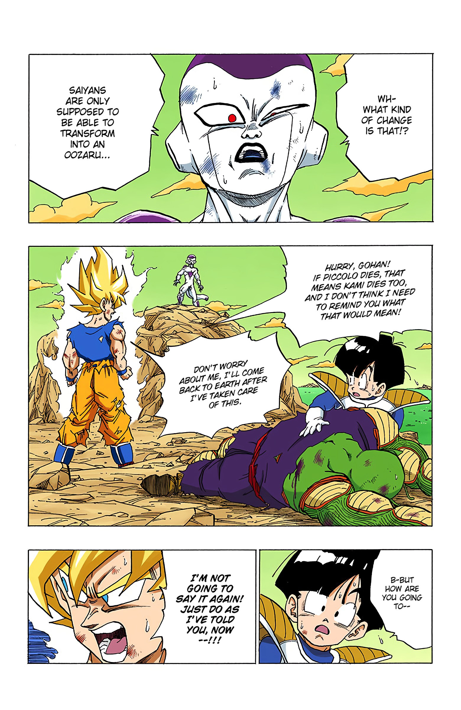
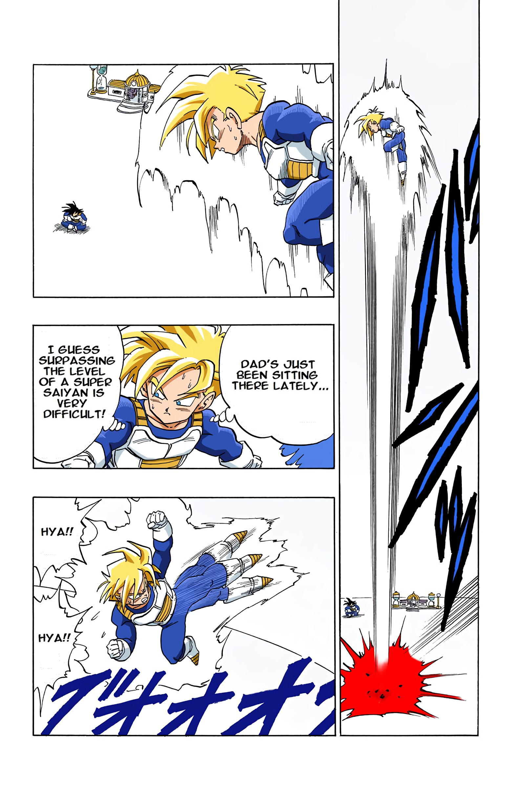
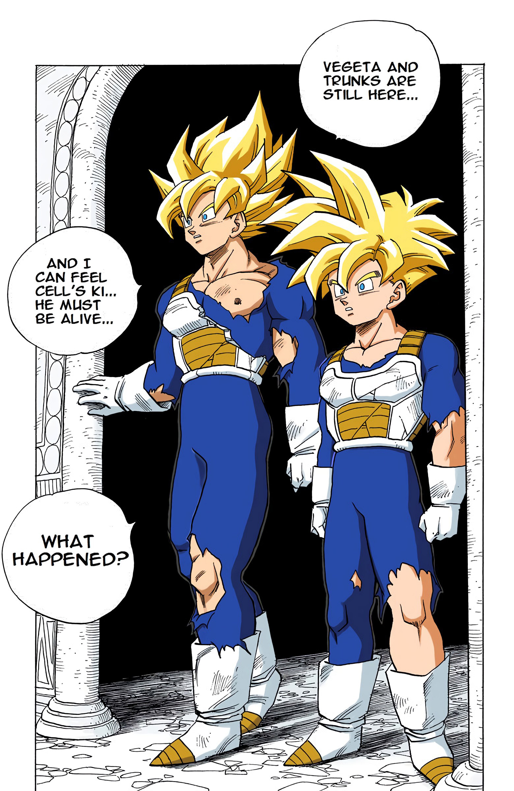
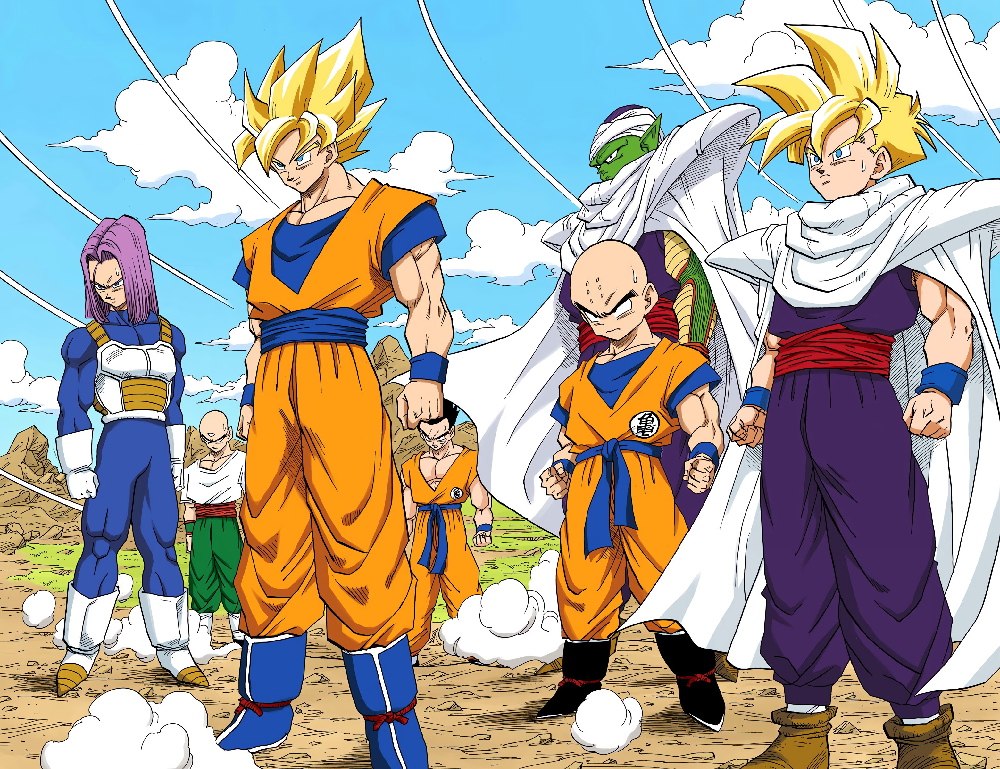

In reply to...  
  
The above person's comment implies that the mastered super saiyan has a different color scheme than the "normal" super saiyan...  
Quoting themselves,  
> During the training period before the cell games, Goku had Gohan and himself train by just chilling in SS form. It was a deliberate design choice to give them a calming pale yellow hue that we hadn’t really seen before. The idea was that SS is normally a battle mode, but by learning to make it feel like base form, you’d gain significant chi control. Idk if there was an official name for this but I see most people call it perfect control.

ㅤ
Below are some pictures from the officially colored Dragon Ball manga...  
ㅤ  
ㅤ  
ㅤ  
  
ㅤ  
ㅤ  
ㅤ    
Above you can see how Super Saiyan was in the original battle against Frieza.  
ㅤ  
ㅤ  
ㅤ    
  
ㅤ  
ㅤ    
Above you can see Super Saiyan Gohan in the Hyperbolic Time Chamber.. This might seem similar to 
Goku in Goku versus Frieza, but here Gohan isnt in the form immediately, he is practicing in it  
voluntarily, so you may argue that he is or is not in the "controlled" ssj state.  
ㅤ  
ㅤ  
ㅤ  
  
ㅤ  
ㅤ  
ㅤ  
This is them, right after completing training in the Hyperbolic Time Chamber. Notice how the hair  
color is the same?.. One might argue that they haven't started "relaxing" like they did in the  
next 7 days, hence the hair color. and I'd agree with that as the relaxing part did help with  
mastering super saiyan, but..  
ㅤ  
ㅤ  
ㅤ  
  
ㅤ  
ㅤ  
ㅤ  
.. this is them at the beginning of their rest..  
ㅤ  
ㅤ  
ㅤ  
  
ㅤ  
ㅤ  
ㅤ  
Them nearing the end of their rest  
ㅤ  
and finally...!  
ㅤ  
ㅤ  
ㅤ  
  
ㅤ  
ㅤ  
ㅤ  
The above is them at the cell games. If you still don't think they're in perfect control...  
well I'll leave the rest upto you!!  
ㅤ  
ㅤ  
ㅤ  
Bonus Panel \(one of my favorites too!!\):  
ㅤ  
ㅤ  
  
ㅤ  
ㅤ  
ㅤ  
Also below is Super Saiyan vs. Frieza FROM THE ANIME... without his aura.  
ㅤ  
ㅤ  
ㅤ  

ㅤ  
ㅤ  
ㅤ  
Thanking you...  
Yours truly  
miqumi  
:D  
ㅤ  
ㅤ  
If you were offended by anything i said, im deeply sorry; I almost never mean any offense!!
